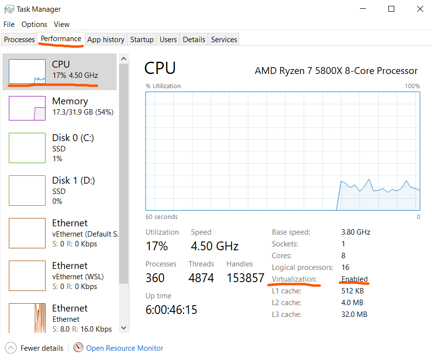
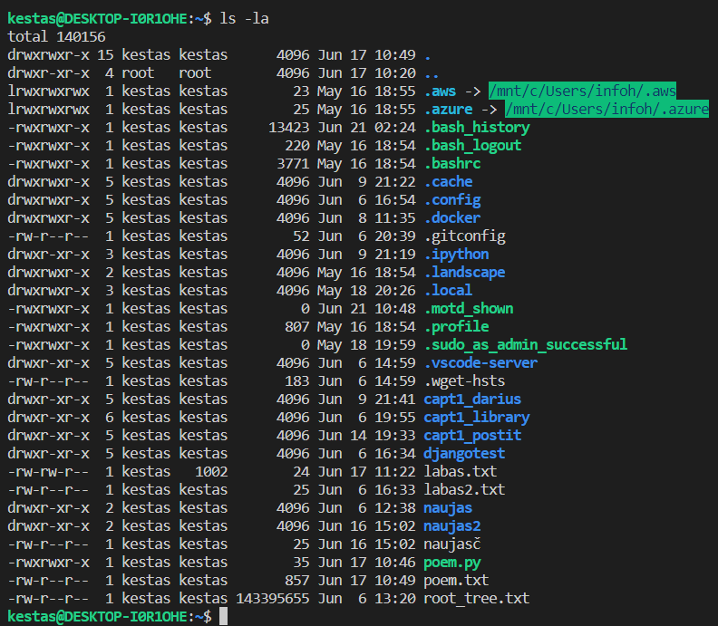
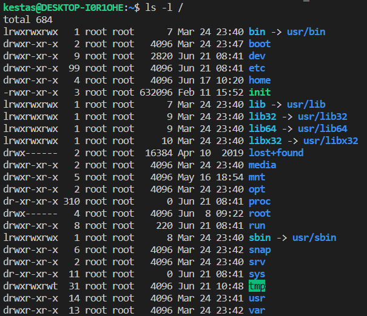
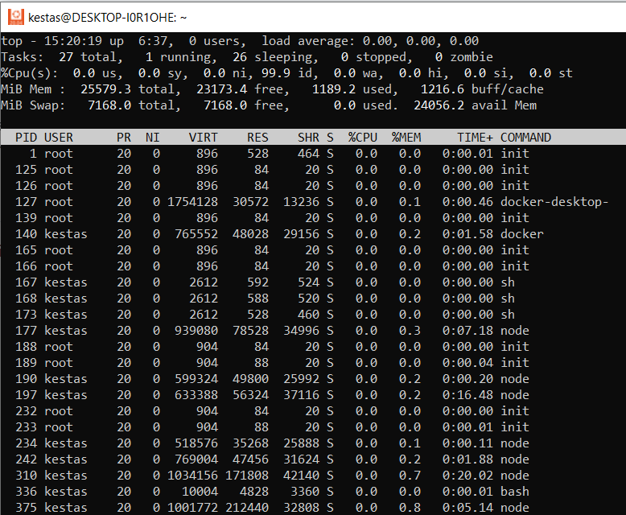

# WSL2 (Windows Subsystem for Linux v2)

Aktualu tik Windows'ams. MacOS vartotojai tiesiog naudos Docker'į, o vietinę Linux komandinės eilutės funkcionalumą papildo [MacPorts](https://www.macports.org/) programa. Kurso medžiaga yra paruošta naudojant Windows 10. Netestuota, be turėtų veikti su Windows 8.1 ir Windows 11.

* Pasižiūrime ar mūsų procesorius palaiko virtializaciją, naudodami Task Manager. Atsidarykite Performance --> CPU ir apačioje dešinėje yra `Virtualization` parametras. Jis turi būti įjungtas. 
.

    * Virtualizaciją įjungti, jeigu procesorius ją palaiko, galima per kompiuterio BIOS. Dažniausiai BIOS CPU skiltyje bus tokie pasirinkimai kaip SVT, Virtualization, Hyper-V. Reikia įjungti visas. Jeigu AMD Ryzen sistemose atsirado nestabilumas, išjunkite C-State Control. Dabar turėtų pavykti. Deja, instrukcijos negalime pateikti, nes kiekvieno kompiuterio BIOS vartotojo sąsaja ir pasiekiamumas skiriasi. Konsultuojamės su dėstytoju individualiai.

* Atsidarome command prompt (cmd.exe) kaip administratorius

    * Start/Search
    * įrašome `cmd`
    * Run as Administrator

* Vykdome komandas, kurios įjungs pagal nutylėjimą neįjungtas Windows funkcijas: Windows Subsystem for Linux ir virtualizaciją
```
dism.exe /online /enable-feature /featurename:Microsoft-Windows-Subsystem-Linux /all /norestart
```
```
dism.exe /online /enable-feature /featurename:VirtualMachinePlatform /all /norestart
```

Jeigu nepavyko atlikti šių operacijų, dar kartą įsitikinkite, kad jūsų procesoriaus (CPU) virtualizacija yra įjungta. 

* Padarius šiuos veiksmus perkraukite kompiuterį.

* Atsisiunčiame WSL [atnaujinimą](https://wslstorestorage.blob.core.windows.net/wslblob/wsl_update_x64.msi) ir jį instaliuojame

* toliau vykdome komandą, kurios pagalba nustatysime, kad pagal nutylėjimą visada Linux'ui Windows'ai naudotų antrą WSL versiją.
```
wsl --set-default-version 2
```

* Instaliuojame Pasirinktą Linux operacinę sistemą. Šiam kursui naudojame Ubuntu 20.04, bet galite pasirinkti ir kitą distribuciją (pvz. naujausia Ubuntu 22.04, tiesiog Debian ar Fedora)
Komandinėje eilutėje įvykdžius komandą Linux bus instaliuotas:
```
wsl --install -d Ubuntu-20.04
```

* Alternatyviai, galima Ubuntu 20.04 instaliuoti ir [iš Microsoft Store](https://www.microsoft.com/store/apps/9n6svws3rx71)

* Po instaliacijos, atsidariusiame komandinės eilutės terminale susikurkite savo vartotojo vardą ir slaptažodį. Slaptažodį reikia įsiminti.

---

# LINUX komandinė eilutė `bash`


Standartinė daugumoje Linuxų komandinė eilutė yra `bash`. Ją ir naudosime. Bash komandinės eilutės `prompt` (eilutės pradžia) pagal nutylėjimą yra: 
``` bash
vartotojo_vardas@host:katalogas$
```

---
# Pagrindinės komandos

`help` galima gauti sąrašą galimų `bash` komandų, bet 

`clear` komanda išvalo ekraną

---
## Failų sistema ir navigacija po ją

`pwd` komanda galima pamatyti, kuriame kataloge esate.
``` bash
kestas@DESKTOP-I0R1OHE:~$ pwd
/home/kestas
```

`cd` komandą naudojame, kad pereiti į kitą katalogą. Galima naudoti absoliutų kelią, prasidedantį `/`, pvz.: 
``` bash
kestas@DESKTOP-I0R1OHE:~$ cd /home
kestas@DESKTOP-I0R1OHE:/home$ pwd
/home
kestas@DESKTOP-I0R1OHE:/home$ cd /usr/bin
kestas@DESKTOP-I0R1OHE:/usr/bin$ pwd
/usr/bin
```

reliatyvų kelią, pvz.: 
``` bash
kestas@DESKTOP-I0R1OHE:/usr/bin$ cd ../
kestas@DESKTOP-I0R1OHE:/usr$ pwd
/usr
kestas@DESKTOP-I0R1OHE:/usr$ cd lib
kestas@DESKTOP-I0R1OHE:/usr/lib$ pwd
/usr/lib
kestas@DESKTOP-I0R1OHE:/usr/lib$ cd ../../home/kestas
kestas@DESKTOP-I0R1OHE:~$ pwd
/home/kestas
kestas@DESKTOP-I0R1OHE:~$ cd ../..
kestas@DESKTOP-I0R1OHE:/$ pwd
/
```

arba nuorodą, pvz.: 
``` bash
kestas@DESKTOP-I0R1OHE:/$ cd ~
kestas@DESKTOP-I0R1OHE:~$ pwd
/home/kestas
```

---
`ls` komanda galima pasižiūrėti katalogo, kuriame esate, turinį.

Prie komandų galima naudoti parametrus ir argumentus. Pvz. `ls -l` su argumentu `-l` galime gauti detalesnį katalogo turinį, o parametras `-a` parodo paslėptus failus. 

`Ubuntu` jau kurį laiką palaiko komandą `ll`, kuri atitinka `ls -la`.

Komandos argumente galime nurodyti, kurio katalogo turinį norime peržiūrėti. Pvz. `ls -l /` mums parodys detalų pagrindinio sistemos katalogo tuniį. 


### Linux failų sistema, pavadinimai ir sistemos katalogų išdėstymas

ženkliai skiriasi nuo Windows. Visų pirma katalogų medis nebūtinai prasideda diskais ar duomenų saugojimo įrenginiais. Diskai neįvardinti raidėmis (C, D, X...), o iškart įvardijami pagal jų paskirtį arba priskirti katalogui, kurio duomenys saugomi). Pagrindinis katalogas `/` dažniausiai atitinka `C:\` diską Windows'uose, bet nebūtinai.

* `bin` kataloge dažniausiai saugomi paleidžiamieji failai. Pavadinimo kilmė - sutrumpintas žodis `binaries`. Anksčiau buvo kelios vietos `bin` failams sistemoje - `sbin`, `usr/bin`... dabar jos visos apjungto į vieną `usr/bin`, o `bin` ir `sbin` yra tiesiog nuorodos.

* `home` ir `root` kataloge skirtas vartotojų failams.
* `etc` kataloge skirtas sistemos ir įvairių programų konfigūracijai.
* `boot` katalogas skirtas Linux sistemos paleidžiamiems failams.
* `lib`, `lib32`, `lib64` yra sistemos/programų bibliotekų katalogai. Windows atitikmuo būtų `Windows\System`, `Windows\System32` ir t.t.
* `opt` dažniausiai laikomi ne pagrindinio sistemos paketo valdiklio (`packet manager`), pvz. Debian atveju `apt` (Advanced Package Tool), failai. Pvz. jeigu parsisiunčiame savo kažkokią programą - jos failus dedame į `/opt`
* `snap` kataloge yra laikomos `snap` programų valdiklio įdiegtos programos.
* `usr` yra kitų pagrindinių sistemos programų failams skirtas katalogas, kuriame bus `bin`, `lib` ir kiti katalogai. Windows'uose šis katalogas atitiktų `Program Files`.
* `dev`, `proc` - sisteminiai katalogai. Juose saugomi failai dažniausiai yra tiesiogiai susiję su jūsų sistemos technine įranga, ir jų turinys nėra informacija diske, bet tiesioginė sąsaja su techine įranga.
* `run` ir `srv` katalgoai skirti programų ar procesų vykdymui. Šiuose kataloguose esančiais failais galima tiesiogiai pasiekti paleistų programų procesus.
* `tmp` yra laikinų failų katalogas
* `lost+found` yra `Recycle Bin` - šiuokšlinės atitikmuo. Retai naudojamas.
* `mnt` yra skirtas vidinių diskų pasiekimui, juos prijungus (`mount`). WSL atveju, jūsų C:\ diskas bus `/mnt/c/`, kaip ir visi kiti Windows diskai raidėmis.
* `media` yra skirtas išorinių diskų pasiekimui (pvz. USB raktų, USB SSD, CD/DVD ir pan.), juos prijungus (`mount`).

---
### Failai, paieška, paieška paieškoje, rezultatų skaitymo būdai

Kitaip negu Windows'uose, Linux'o failų sistema failų pavadinimuose vertina distinktyviai didžiąsias ir mažąsias raides. Vadinasi, Windows'uose `Labas.txt` ir `labas.txt` yra tas pats failas, bet Linux'e tai yra skirtingi failai, ir jie galėtų netgi būti tame pačiame kataloge.

Kol neišmokome vartotojų teisių, apribosime savo veikslus savo namų katalogu (`~` arba `/home/vartotojas/`).

* `touch failas.txt` sukuria naują failą `failas.txt`.
* `echo "tekstas faile" >failas.txt` įrašo tekstą į failą iš komandinės eilutės. Čia `echo` komanda yra skirta atkartoti tekstui komandinėje eilutėje, o `>failastxt` nurodo, kad komandinės eilutės išvedimas turėtų eiti ne į ekraną, o į failą.
* `cat failas.txt` išspausdins failo turinį.
* `tail failas.txt` išspausdins failo galo (paskutines 10 eilučių) turinį. Aktualu, pvz. peržiūrėti "gyvo" .log failo turinį.
* `find paieškos_argumentas` - ieškom, pvz. python'o - find `/*/python`.

Sekančiam pavyzdžiui pasiimsim ilgą find: `find /usr/bin/`.
* Norint perskaityti failą, ilgesnį negu terminalo aukštis, galime naudoti lygiagrečią komandą `less`. Pvz.:
``` bash
find /usr/bin/ | less
```
> Po rezultatą galime naviguoti kryptyniais klavišais, `page up`/`page down`, `home`/`end` klavišais, ir išeiti su `q` arba `ESCape` klavišu. <br> Ne visose Linux distribucijose būna `less`, bet visose būna primityvesnė funkcijos versija `more`. Su `more` galima tik eiti žemyn spaudžiant `ENTER` (po eilutę) ir tarpo (po puslapį) klavišais.

### grep

Ieškoti paieškoje, arba bet kokiame kitame komandinės eilutės rezultate, galime naudojant lygiagrečią `grep`. Ji išskirs eilutes, kuriose bus ieškomas tekstas. Pvz. `find /usr/bin/ | grep python`.
grep galima naudoti ir parametrus, palengvinančius paiešką - `-i` raktas nurodo, kad ieškant nekreipti dėmesio į didžiąsias/mažąsias raides, `-n` sunumeruoja rezultato eilutes, o `-C` nurodo, kiek eilučių parodyti prieš/po rezultatą (arba veikia `-B` before, `-A` after.

---
### Katalogų kūrimas, failų/katalogų kopijavimas, perkėlimas, trynimas

* `mkdir naujas` - sukuriame katalogą naujas
* `cp labas.txt naujas/` - kopijuojame failą `labas.txt` į katalogą `naujas`.
* `cp labas.txt naujas/labas2.txt` - kopijuojam failą `labas.txt` į katalogą `naujas`, pervadinant jį į `labas2.txt`. 
* `mv naujas/labas2.txt .` - perkeliame failą labas2.txt iš `naujas` katalogo į mūsų dabartinį katalogą (turėtu būti `~`).
* `mv naujas senas` - pervadins katalogą `naujas` į katalogą `senas`.
* `rm labas2.txt` ištrina failą `labas2.txt`.
* `rm -r senas` ištrina visą katalogą. Norint kad neuždavinėtų klausimo trinant kiekvieną failą, reikia nurodyti raktą `-f`.

# Komandų istoriją

Komanda `history` galite pasižiūrėti savo vykdytų komandų istoriją. Sąrašas greičiausiai bus labai ilgas, tai siūlytume naudoti `| tail` pamatyti paskutiniams įrašams, arba `| less` kad valdyti jo išspausdinimą.

# Kompiuterio atminties, paleistų procesų situacija

Pamatyti esamą kompiuterio atminties situaciją galima panaudojant komandą `top`, iš kurios galima bus išeiti paspaudus `q` klavišą.


Alternatyviai, procesų sąrašą galima pasižiūrėti `ps` komanda. `-a` raktas parodys ir kitų vartotojų procesus. `-A` parodys dar pridės ir sistemos procesais `-l` parodys išplėstą lentelę su procesų parametrais.


Kad "nužudyti" negyvą/pakibusį procesą, galite naudoti komandą `kill -9 pid`, kur PID yra pasirinktas proceso ID (pvz. iš `top` programos lentelės). Jeigu procesą valdo ne jūsų vartotojas, jums reikės `root` teisių - apie jas sekančioje paskaitoje.

---
# Užduotys
*  
